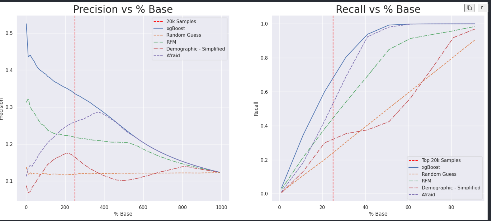

# Avaliação da propensão de crosseling dos clientes de uma seguradora de saúde. 

## 1.0 Desafio: 
A empresa Você Mais Seguro fornece planos de saúde e seguros de vida. 
A empresa está interessada em lançar um novo seguro de veiculos e acredita no potencial que possuí dos clientes em sua base. 
Em uma primeira etapa, foi realizada uma grande pesquisa com uma parcela de seus clientes para entender quais destes clientes estariam interessados em adquirir o novo seguro de veiculos.

No entando, restam mais de 80 mil clientes ainda não abordados, além dos novos clientes que vem entrando na base. O CFO já informou ao diretor comercial que havia orçamento para contatar apenas 20 000 dos mais de 80 000 clientes ainda não abordados. 

Para lidar com o  desafio de bater a meta de vendas do comercial para o novo produto e ainda assim manter a conformidade orçamentária, o diretor comercial solicitou ao time de dados um produto capaz de identificar os clientes que realmente desejam adquirir o seguro veicular, para garantir que sua ação com 20 000 clientes seja o mais assertiva possível. 

Para resolver este problema nasceu este projeto, uma solução capaz de avaliar o indice de propensão de compra de cada cliente da base, que se mostrou **300% mais assertivo** que uma abordagem aleatória e **30% mais acurado** que a melhor premissa de negócio, com potencial de alavancar o faturamento anual estimado da ação em **R$ 8 Milhões** caso fosse usada a **abordagem aleatória** e em  **R$ 3 Milhões no caso de uso da melhor premissa de negócio**

O modelo final, foi disponibilizado em uma aplicação web, a qual é acessível via url:  [PropensityToByDataApp](https://propensao-de-compra-production.up.railway.app/)
Fonte Dataset: 

------ 
## 2.0 Descrição da solução

### 2.1 - EDA (Exploratory Data Analisys) - Top Insigths 

* 1. Clientes com veiculos mais antigos no geral, possuem uma maior tendencia a adquirir o seguro.

* 2. Clientes que já possuem seguro veicular, possuem uma propensão de compra muuito menor, quando comparados a clientes que ja possuem seguro. 

* 3. Clientes que ja tiveram algum sinistro registrado, possuem uma propensão maior a adquirir um seguro veicular. 

* 4. A regiao 28 concentra quase metade (42%) dos clientes com intenção de adquirir um 
seguro veicular. 

* 5. Clientes na faixa de 30-40 anos são mais propensos a adquirir um seguro, quando comparado aos demais grupos de idade.

* 6. Não há relação entre o tempo do cliente na base e sua propensão em adquirir um seguro veicular.

        - **Recomendação:** Avaliar se as ações de construção de relacionamento realizadas pelo CS estão sendo efetivas, uma vez que a confiança do cliente na marca aparenta não crescer com seu tempo na base. 

### 2.2 - Modelagem em top ranking e metricas de avaliação. 

O problema em pauta, exige uma solução de ranqueamento. A idéia central por trás de algoritmos de ranqueamento esta em se atribuir um score (a cada a mostra do dataset) capaz de representar quantitativamente, o quanto que um cliente possui de probabilidade de adquirir um seguro veicular. A este score, demos o nome de "propensão de compra" 

Com cada um dos clientes possuindo uma feature de propensão de compra, a tarefa de ranqueamento torna-se simplesmente ordenar a lista do maior para o menor. Ou seja, o desafio do projeto é encontrar uma maneira de gerar de nabeura assertuva, esta probabilidade para cada cliente.

**2.2.1 - Modelando probabilidades** 

Para  o desafio de modelar as probabilidades de propensão de compra, podemos utilizar algoritmos classicos de classificação, uma vez que os mesmos em sua essencia, apenas modelam uma probabilidade de cada amostra pertencer a cada uma das classes. Neste caso, nossas "classes" são se o cliente vai ou não adquirir um seguro veicular, e o algoritmo estima a probabilidade dos eventos "compra o seguro" e "não compra o seguro" acontecer.

Durante o projeto foram realizados testes com os seguintes algoritmos:
    * Random Forest
    * Regressão Logistica 
    * KNN Classifier
    * Redes Neurais Artificiais
    * xGboost 

Sendo, o modelo que apresentou melhor desempenho (e o modelo escolhido) o xGboost. 

**2.2.2 - Avaliando modelos de ranqueamento** 

Diferente do processo de se avaliar um algoritmo de classificação sob a ótica/objetivo de apenas classificar uma amostra, onde métricas como accuracy, precision, recall, auc, f1 - score, geralmente são suficientes para se avaliar o desempenho final do modelo, para problemas de ranqueamento o jogo muda. 

No cenário de ranqueamento estamos interessados não na classificação em si, mas no score de probabilidade que o modelo atribui a cada amostra, por isso métricas como:
    * Top k Precision - Onde avalia-se a precisão do modelo para um top k itens ranqueados, onde k, é o tamanho da amostra a ser avaliada.
    * Top k Recall    - Onde avalia-se a precisão do modelo para um top k itens ranqueados, onde k, é o tamanho da amostra a ser avaliada.

Para nosso problema, onde o objetivo é maximizar a conversão dos 20 mil clientes contatados, desejamos otimizar nossa top 20k precision, o que irá garantir que ao escolher 20 mil clientes para entrar em contato, seja possível garantir que teremos o maior número de conversões. 

### 2.3 - Data APP com da solução
Toda a solução foi encapsulada em um data app streamlit, e disponibilizada em: [PropensityToByDataApp](https://propensao-de-compra-production.up.railway.app/)

Para melhor gestão da aplicação e do processo de deploy, foi definida uma imagem docker do projeto, o arquivo de configuração da imagem encontra-se disponível em /src/Dockerfile 

-----
### 3. Resultados 

Para avaliação do modelo de machine learning, foram utilizadas as métricas:

* **Precision top k** - Que avalia a precisão do modelo, para os top k clientes melhores ranqueados (por propensão de compra), ou seja, por exemplo, para os 10 primeiros clientes da minha lista final ranqueada,se 3 realmente desejam adquirir um seguro veicular, minha precison top k (com k = 10) é de 30%. 

* **Recall top k** -  Avalia o recall do modelo, ou seja quanto % de todos os interessados em comprar um seguro veicular, foram identificados pelo modelo. Este racional é utilizado na visão top k, ou seja: Para os k primeiros elementos da minha lista ranqueada por propensão de compra, quanto que estes top k, representam de todos os clientes interessados em se adquirir um seguro veicular. Em resumo a métrica responde sobre a capacidade do modelo em identificar todos os interessados em adquirir um seguro veicular. 

No entanto **somente as métricas não são suficientes** para avaliar o modelo, é preciso comparar estes resultados com alguma referencia. Para tanto além da abordagem aleatória ("random guess"), foram utilizadas algumas premissas de negócio que poderiam ser utilizadas pelo time comercial, uma vez que não possuíssem o modelo de machine learning, as quais são: 

* **1 - Afraid:**
     - A premissa se basea na experiencia do cliente. Nela afirmamos: Clientes qua ja tiveram algum sinistro veicular registrado e ainda não possuem seguro veicular, possuem uma maior propensão de compra, por conta disso serão priorizados clientes que se encaixam nestes requisitos. 

* **2 - RFM Simplified:** 

    - Utilizamos como base da premissa, uma simplificação da metodologia de analise rfm (recencia, frequencia, valor) 
    - Desta maneira, os clientes serão ordenados pelas categorias a seguir (priorizando os critérios na mesma ordem que os apresentaremso - 1 é mais prioritário que 3):

        * *2.1 Recencia:* Clientes a mais tempo na base, devem possuir uma maior confiança no produto, por conta disso a primeira premissa de priorização será por 1/recencia, ou seja, clientes com mais tempo na base. 

        * *2.2 Frequencia:* Para definição de frequencia, serão priorizados clientes de canais de venda, com maior frequencia de vendas. Ou seja, canais com maior taxa de conversão (frequencia) serão priorizados. 

        * *3.3 Valor:* Clientes com maior Annual Premium, vem primeiro. 

* **3 Demography.** 
    - Aqui serão utilizados conceitos demograficos para a priorização dos clientes, ou seja, serão priorizados:
        
        * 1 - Clientes do sexo masculino 
        * 2. Clientes com idade mais avançada  

-----

A partir destas premissas é possível, utilizando as mericas precision top k e recall top k, avaliar o modelo de machine learning. 

**Tabela comparativa das soluções**
| model | dataset | precision_top_k | business_customers_revenue |
| :--- | :--- | :--- | :--- |
| XGBoost | test | 0.335856717 | R$ 12.125.078,36 |
| Afraid_Business_Perspective | test | 0.259455189 | R$ 9.366.835,14 |
| RFM_Business_Perspective | test | 0.218354367 | R$ 7.883.015,81 |
| Demographic_Business_Perspective | test | 0.164703294 | R$ 5.946.108,10 |
| Random Guess | test | 0.122702454 | R$ 4.429.796,38 |

---- 
**Comparativo - Visão grafica**

